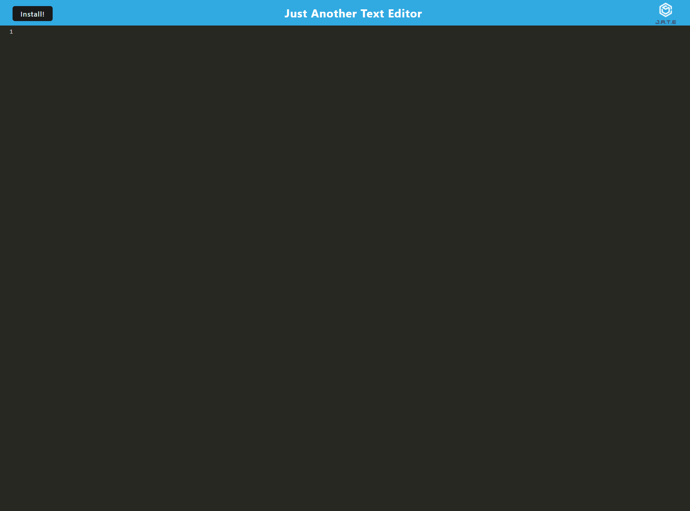

# Text-Editor 

## Description

In this PWA assignment it uses IndexDb to save notes and can be run offline or online.

# Table of Contents

- [Link](#link)

- [Screenshot](#Screenshot)

- [Licensing](#licensing)

# Link

Here is a link to my deployed website: https://quiet-springs-07200.herokuapp.com/

# Screenshot

# Licensing

This project is licensed under the MIT license.

